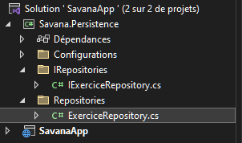
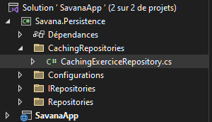
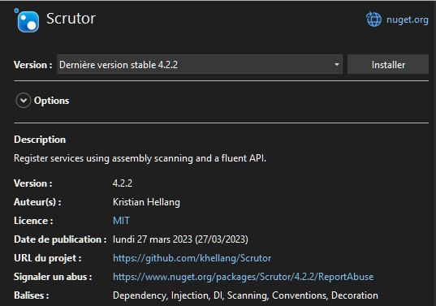

### Implementing Caching with Decorator Pattern and Scrutor Library

**Read time** : 5 minutes.
##


Hello everyone! 
Today, we'll delve into the process of implementing caching into your repository with the decorator pattern using the scrutor library.

The goal of this pattern is to extend new behavior to your class without impacting the original implimentation.

Here i want to add a caching behavior to ***GetById*** method within my class ***ExerciseRepository***  as shown below:


```c#
using Savana.Persistence.IRepositories;

namespace Savana.Persistence.Repositories
{
    public sealed class ExerciseRepository : IExerciseRepository
    {
        private readonly SavanaDbContext _dbContext;

        public ExerciseRepository(SavanaDbContext dbContext)
        {
            _dbContext = dbContext;
        }

        public async Task<Exercise?> GetById(Guid id, CancellationToken cancellationToken =default)
        {
            return await _dbContext.Set<Exercise>()
                .FirstOrDefaultAsync(exercise => exercise.id = id, cancellationToken);
        }
    }
}
```

Im going to use the scrutor library to add support for dependency injection 
so in runtime i can provide the decoration implementation of the Exercise Repository.


To proceed, I'll create a new folder which i called ***CachingRepositories***. Within this folder, I'll create a new class titled ***CachingExerciseRepository*** as below:



```c#
using Savana.Persistence.IRepositories;

namespace Savana.Persistence.CachingRepositories
{
    public sealed class CachingExerciseRepository : IExerciseRepository
    {
        private readonly IExerciseRepository _exerciseRepository;

        public CachingExerciseRepository(IExerciseRepository exerciseRepository)
        {
            _exerciseRepository = exerciseRepository;
        }

        public async Task<Exercise> GetById(Guid id, CancellationToken cancellationToken = default)
        {
            return await _exerciseRepository.GetById(id, cancellationToken);
        }
    }
}
```

This class implements the ***IExerciseRepository*** interface.
 Additionally, I've injected an instance of the ***IExerciseRepository*** to access the existing service registration of this interface, which, in our case, refers to the ***ExerciseRepository***. Here, I'll implement all the interface methods using this base implementation.
To introduce caching behavior, i'll inject an instance of ***IMemoryCache*** into my class and i will implement caching as below:

```c#
using Microsoft.Extensions.Caching.Memory;
using Savana.Persistence.IRepositories;

namespace Savana.Persistence.CachingRepositories
{
    public sealed class CachingExerciseRepository : IExerciseRepository
    {
        private readonly IExerciseRepository _exerciseRepository;
        private readonly IMemoryCache _memoryCache;


        public CachingExerciseRepository(IExerciseRepository exerciseRepository, IMemoryCache memoryCache)
        {
            _exerciseRepository = exerciseRepository;
            _memoryCache = memoryCache;
        }

        public async Task<Exercise> GetById(Guid id, CancellationToken cancellationToken = default)
        {
            return _memoryCache.GetOrCreateAsync($"exercie-{id}",
                async _cacheEntry =>
                {
                    _cacheEntry.SetAbsoluteExpiration(TimeSpan.FromHours(5));
                    return await _exerciseRepository.GetById(id, cancellationToken);
                });
        }
    }
}

```

To avoid hardcoding expiration times, a more effective approach is to establish a generic cache duration, as demonstrated below:

```c#
using Microsoft.Extensions.Caching.Memory;
using Savana.Persistence.IRepositories;

namespace Savana.Persistence.CachingRepositories
{
    public sealed class CachingExerciseRepository : IExerciseRepository
    {
        private readonly IExerciseRepository _exerciseRepository;
        private readonly IMemoryCache _memoryCache;
        private static readonly TimeSpan expirationTime = TimeSpan.FromHours(5);


        public CachingExerciseRepository(IExerciseRepository exerciseRepository, IMemoryCache memoryCache)
        {
            _exerciseRepository = exerciseRepository;
            _memoryCache = memoryCache;
        }

        public async Task<Exercise> GetById(Guid id, CancellationToken cancellationToken = default)
        {
            return _memoryCache.GetOrCreateAsync($"exercie-{id}",
                async _cacheEntry =>
                {
                    _cacheEntry.SetAbsoluteExpiration(expirationTime);
                    return await _exerciseRepository.GetById(id, cancellationToken);
                });
        }
    }
}
```

 To further eliminate hardcoded cache keys, another step involves creating a static class named ***CacheKeys***. Within this class, individual cache keys can be defined, as depicted below:
 
```c#
namespace Savana.Persistence.Configurations
{
    public static class CacheKeys
    {
        public static Func<Guid,string> ExerciseById = exerciseId=>$"Exercise-{exerciseId}";
    }
}
````

Finally my ***CachingExerciseRepository*** will look like that:
 
```c#
using Microsoft.Extensions.Caching.Memory;
using Savana.Persistence.Configurations;
using Savana.Persistence.IRepositories;

namespace Savana.Persistence.CachingRepositories
{
    public sealed class CachingExerciseRepository : IExerciseRepository
    {
        private readonly IExerciseRepository _exerciseRepository;
        private readonly IMemoryCache _memoryCache;
        private static readonly TimeSpan expirationTime = TimeSpan.FromHours(5);


        public CachingExerciseRepository(IExerciseRepository exerciseRepository, IMemoryCache memoryCache)
        {
            _exerciseRepository = exerciseRepository;
            _memoryCache = memoryCache;
        }

        public async Task<Exercise> GetById(Guid id, CancellationToken cancellationToken = default)
        {
            return _memoryCache.GetOrCreateAsync(CacheKeys.ExerciseById,
                async _cacheEntry =>
                {
                    _cacheEntry.SetAbsoluteExpiration(expirationTime);
                    return await _exerciseRepository.GetById(id, cancellationToken);
                });
        }
    }
}
```

So, the remaining step is to configure dependency injection using Scrutor. To begin, I'll install the Scrutor library.




And finally update the dependency injection as illustrated below:
```c#
        public static IServiceCollection AddInfrastructure(this IServiceCollection services)
        {
            services.AddScoped<IExerciseRepository, ExerciseRepository>;
            services.Decorate<IExerciseRepository, CachingExerciseRepository>;
            return services;
        }
```

Hope this was helpful.
See you in the next week.


