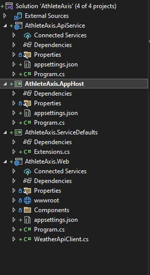
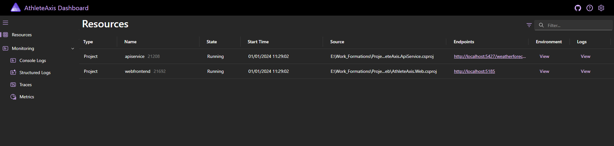
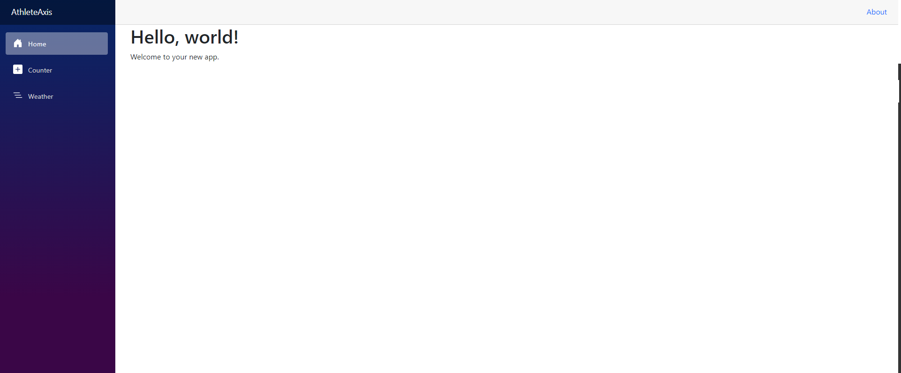
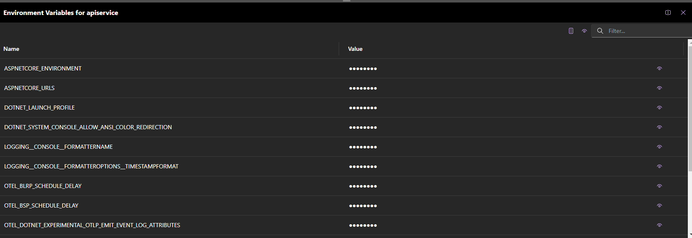

### First look at Aspire

**Read time**: 5 minutes.
##

Hello everyone, today we will take a first look at Aspire and see what we can do using it.

Aspire is a new framework introduced in .Net 8 that simplifies the development of cloud-native applications. It is an opinionated stack that provides a curated set of components and patterns for building resilient, observable, and configurable cloud-native applications with .NET.

To get started we have to choose one of these two available templates:

```
Ces modèles correspondent à votre entrée : 'aspire'.

Nom du modèle                    Nom court       Langue  Balises
-------------------------------  --------------  ------  -------------------------------------------------------
.NET Aspire Application          aspire          [C#]    Common/.NET Aspire/Cloud/Web/Web API/API/Service
.NET Aspire Starter Application  aspire-starter  [C#]    Common/.NET Aspire/Blazor/Web/Web API/API/Service/Cloud
```

The first template is the blank framework for the .Net Aspire application, while the second template constitutes a starter application equipped with a pre-configured Blazor frontend and web API backend.

Below is the solution structure you receive upon scaffolding a new .Net 8 Aspire application.



There are a total of 4 projects within this structure. Let's delve into each of them individually, beginning with the web API. It is a .Net 8 Web API that comes with predefined service defaults, exposing problem details and constructing the web application. This API serves to expose a single endpoint. 


```c#
var builder = WebApplication.CreateBuilder(args);

// Add service defaults & Aspire components.
builder.AddServiceDefaults();

// Add services to the container.
builder.Services.AddProblemDetails();

var app = builder.Build();

// Configure the HTTP request pipeline.
app.UseExceptionHandler();

var summaries = new[]
{
    "Freezing", "Bracing", "Chilly", "Cool", "Mild", "Warm", "Balmy", "Hot", "Sweltering", "Scorching"
};

app.MapGet("/weatherforecast", () =>
{
    var forecast = Enumerable.Range(1, 5).Select(index =>
        new WeatherForecast
        (
            DateOnly.FromDateTime(DateTime.Now.AddDays(index)),
            Random.Shared.Next(-20, 55),
            summaries[Random.Shared.Next(summaries.Length)]
        ))
        .ToArray();
    return forecast;
});

app.MapDefaultEndpoints();

app.Run();

record WeatherForecast(DateOnly Date, int TemperatureC, string? Summary)
{
    public int TemperatureF => 32 + (int)(TemperatureC / 0.5556);
}

```


Next in line is the Blazor front-end application, which incorporates default services. An intriguing aspect emerges as it configures an HTTP client to communicate with the web API using the URL **"http://apiservice"**. This reference points directly to our web API backend without specifying 'localhost' or a specific port; instead, it solely refers to the API service.

```c#
using AthleteAxis.Web;
using AthleteAxis.Web.Components;

var builder = WebApplication.CreateBuilder(args);

// Add service defaults & Aspire components.
builder.AddServiceDefaults();

// Add services to the container.
builder.Services.AddRazorComponents()
    .AddInteractiveServerComponents();

builder.Services.AddOutputCache();

builder.Services.AddHttpClient<WeatherApiClient>(client => client.BaseAddress = new("http://apiservice"));

var app = builder.Build();

if (!app.Environment.IsDevelopment())
{
    app.UseExceptionHandler("/Error", createScopeForErrors: true);
}

app.UseStaticFiles();

app.UseAntiforgery();

app.UseOutputCache();

app.MapRazorComponents<App>()
    .AddInteractiveServerRenderMode();

app.MapDefaultEndpoints();

app.Run();

```

Let's now explore the two Aspire projects. Beginning with the AppHost project, serves as the startup project tasked with orchestrating the execution of both the web API and the Blazor front end. Let's delve into the **program.cs** file for further insights

```c#
var builder = DistributedApplication.CreateBuilder(args);

var apiService = builder.AddProject<Projects.AthleteAxis_ApiService>("apiservice");

builder.AddProject<Projects.AthleteAxis_Web>("webfrontend")
    .WithReference(apiService);

builder.Build().Run();

```

Examining the code, you'll notice the use of a distributed application to initialize a new application builder. This builder incorporates various projects, notably our web API backend. An important identifier here is **'apiservice'**, which Aspire employs for service discovery, critical for configuring the HTTP client within the Blazor frontend **(builder.Services.AddHttpClient<WeatherApiClient>(client => client.BaseAddress = new("http://apiservice"));)**. Aspire adeptly maps this reference to the URL and port of the backend API. This **'apiService'** is integrated as a reference within the Blazor frontend's configuration.

This startup project houses the configuration for all applications. When the system launches, Aspire seamlessly manages the simultaneous operation of these applications.

The second Aspire-scaffolded project is the Aspire service defaults, encompassing an extension class facilitating the definition of extension methods. It automates the configuration of essential services within your Aspire applications, including OpenTelemetry, used for capturing metrics, traces, and logs in cloud-native applications.

Now, let's initiate the application and explore its functionality firsthand.:



Upon system startup, you'll be directed to an impressive dashboard showcasing comprehensive information about the applications. Under **'Resources'** you'll find a detailed list of the projects currently running, including the backend API and the Blazor frontend, accompanied by their respective URLs.

Clicking on the frontend component grants access to the application interface, which appears as follows:


Additionally, you can explore the environment variables configured for the projects. Let's examine the environmental settings for the API: 


Displayed here are the environmental variables pertinent to OpenTelemetry within the API. Similarly, the Blazor frontend application also contains its set of environmental configurations. However, the dashboard offers a plethora of other valuable insights:

**Health Monitoring:** Provides real-time information about the application's health.

**Performance Metrics:** Offers detailed performance metrics to gauge efficiency.

**Behavioral Analysis:** Helps in understanding the application's behavior and usage patterns.

The Aspire Dashboard, designed for startup applications, offers an all-encompassing view of health, performance, and behavior, encompassing these key features.

If you learned something useful, I'd appreciate a like on my LinkedIn post to help it reach more people.
