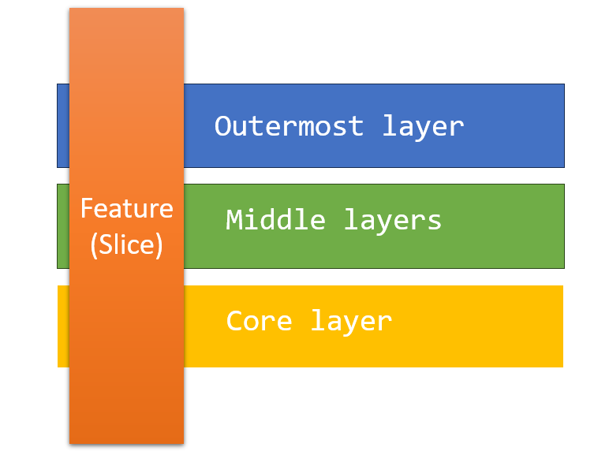
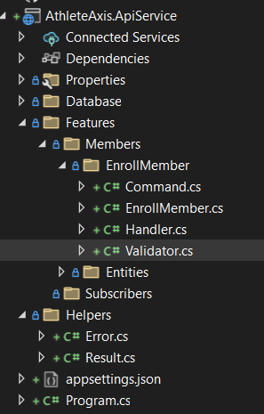

### Vertical slice architecture

**Read time**: 5 minutes.
##

Greetings everyone! Today, our discussion delves into the intriguing realm of the Vertical Slice Architecture, a topic I am particularly passionate about.

**Understanding the Vertical Slice Architecture**

The concept of Vertical Slice Architecture emerged as a response to the challenges posed by traditional layered architectures. Let's dissect the issues inherent in layered architectures.

Layered architecture, while providing organization by separating concerns, introduces constraints on the system. For instance, it dictates the direction of dependencies between layers. Take Onion architecture as an example:

* **Core Layer:** The domain layer with no dependencies.
* **Middle layers:** Application layer, services, etc., depending on the domain layer.
* **Outermost Layer:** Infrastructure layer, handling external concerns like databases, frameworks, UI frameworks, etc. This layer depends on the application layer.

Key benefits of this dependency direction:

* **Loose Coupling:** Inner layers become independent of external implementations, enhancing testability and reusability.
* **Flexibility:** You can change outer layers (e.g., database) without impacting the core domain logic.
* **Testability:** You can easily test inner layers in isolation by mocking out dependencies from outer layers.

Drawbacks of Layered Architecture:

However, the layering approach introduces numerous abstractions between layers, escalating system complexity. For a single feature, layered architecture necessitates changes across various layers, such as updating the domain model, modifying validation logic, creating or updating services, and exposing API endpoints. This results in an increase in complexity because there are multiple components to maintain.

But ***Vertical Silice Architecture*** take a different approach:

It minimizes coupling between features while maximizing coupling within a feature. Represented below, Vertical Slice Architecture offers a distinctive perspective on system design.

All the files for a single feature are grouped in one folder, so the cohesion for a single use case is high. This simplifies the development, and understanding becomes easy as all the components for each feature are located close together in a single folder.

**Implementing vertical slice**

Vertical slice focuses on a single feature, allowing you to treat each use case separately and specify the implementation requirements for each use case independently. One slice can use EF Core to implement a GET request to retrieve elements from a SQL Server database, while another can utilize Dapper with raw SQL queries.

Another benefit is that when you add a new feature, you only need to introduce new code without modifying the shared code, eliminating concerns about potential side effects.

Here's an example of a solution structure in .NET. You'll notice the **EnrollMember** folder, which encompasses the use case or the vertical slice of enrolling a member. The command, the handler, the validator, and the endpoint are all located within the same folder:

In summary, Vertical Slice Architecture offers a practical departure from traditional layered structures, promoting simplicity and cohesion within each feature. Grouping all files related to a feature in a single folder may seem unconventional to some, but this approach significantly enhances development efficiency and code comprehension.

If you learned something useful, I'd appreciate a like on my LinkedIn post to help it reach more people.